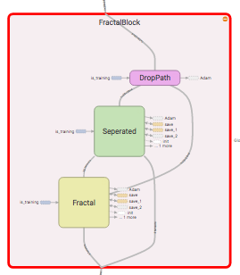

# FractalNet
Implementation of FractalNet (https://arxiv.org/pdf/1605.07648v1.pdf) in TensorFlow.

Fractal blocks have components with separated columns, as well as the fractal layout.
For rounds of training with global drop path, the separated layout is used.
In all other cases, the fractal layout is used.

#Fractal

#Separated

#Entire Block

